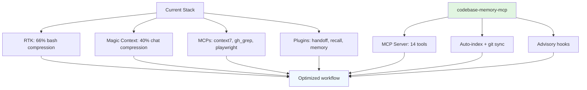

# Plan: Install codebase-memory-mcp for codebase knowledge graph

|          | Created     | Updated    |
| -------- | ----------- | ---------- |
| **Status**   | in_progress | 2026-04-20 |
| **Agent**    | build       | -          |
| **Priority** | high        | -          |

## Execution

| Timestamp  | Step                                |
| ---------- | ----------------------------------- |
| 2026-04-20 | Run official install script         |
| 2026-04-20 | Restart OpenCode to load MCP        |
| 2026-04-20 | Index harness repository            |
| 2026-04-20 | Validate integration with checklist |
| 2026-04-20 | Monitor token gains for 2-3 days    |

## Reason

### Current Problem

The agent spends **~20,000 tokens per session** re-reading the codebase to understand:
- Where functions/classes are located
- Call paths (who calls whom)
- Architecture structure
- Module dependencies

Current plugins **do not solve** this:
- `gh_grep` → textual search, but returns files that still need to be read
- `context7` → external documentation, not own code
- `read` + `grep` → file-by-file approach, token-expensive

### Solution: codebase-memory-mcp

MCP server that indexes the repository into a **knowledge graph** (AST tree-sitter) with:
- 14 MCP tools (search_graph, trace_call_path, get_architecture, detect_changes, etc.)
- Indexing in ~3-30s (medium project)
- Queries in <1ms
- **99% fewer tokens** vs file-by-file approach (3.4k vs 412k tokens in 5 queries)

### Integration with Current Stack

**Each component covers different layer:**
- RTK → bash output
- Magic Context → chat history
- codebase-memory-mcp → code structure (NEW)

### Expected Token Savings

| Component | Baseline (tokens) | With codebase-memory-mcp (tokens) | Savings |
|-----------|------------------|-----------------------------------|---------|
| Codebase queries | ~20,000 | ~300 | ~98.5% |
| Chat (Magic Context) | ~10,000 | ~5,000 | ~50% |
| Bash output (RTK) | ~15,000 | ~5,000 | ~66% |
| **Total** | **~45,000** | **~10,300** | **~77%** |

**Global reduction: ~77%** (from 45k → 10.3k tokens/session)

## Expected Benefits

1. **Instant structure:** `get_architecture()` returns languages, packages, entry points, routes, hotspots in ~800 tokens vs ~12k reading files
2. **Fast call traces:** `trace_call_path(function_name="X")` returns call chains in ~400 tokens vs ~15k manual
3. **Impact analysis:** `detect_changes()` maps git diff to affected symbols + risk classification in ~500 tokens vs ~20k manual
4. **Structured search:** `search_graph` by label (Function, Class, Route) returns precise results without reading files

## Validation Checklist

- [ ] MCP server appears in `/mcp` with 14 tools
- [ ] `index_status` shows `complete` for the project
- [ ] `get_architecture()` returns structured data
- [ ] `trace_call_path` works for known function
- [ ] Advisory hooks remind to use graph before grep/read
- [ ] RTK and Magic Context still work (no regression)

## References

- Repository: https://github.com/DeusData/codebase-memory-mcp
- Documentation: https://deusdata.github.io/codebase-memory-mcp/
- Paper: https://arxiv.org/abs/2603.27277
- Benchmarks: 99% token reduction, sub-ms queries, 66 languages
